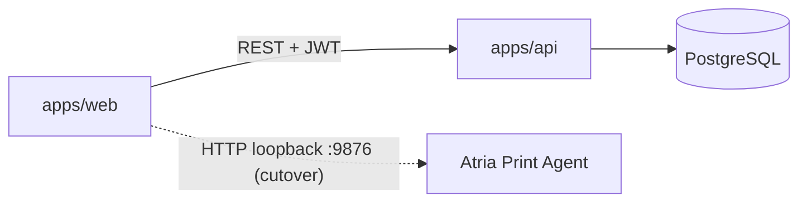

# Arquitectura — L'Scala Inventarios

## Visión

Monorepo con API REST y SPA. El dominio nace **multi-sucursal / multi-POS**: stock, ventas, mermas y gastos se scopan por `branch_id`; las ventas además requieren `pos_id` y `seller_user_id`.

Impresión física de etiquetas/comprobantes: hoy **QZ Tray**; destino **Atria Print Agent** (`127.0.0.1:9876`, carpeta `atria-print-agent/`). Ver [`atria-print-agent-architecture.md`](./atria-print-agent-architecture.md).

## Organización

- `organizations` → `branches` → `pos_terminals`
- `users` ↔ `user_branches` (rol por sucursal: owner, branch_manager, seller)
- Catálogo (`products`, `categories`, `suppliers`) a nivel organización
- `inventory_balances (product_id, branch_id)`

## Flujo operativo

**Ingreso** (UI `/ingresos`; API `purchases` / `purchase_items`) → pendiente recepción → recepción en sucursal → stock → venta en POS / merma / cambio.

Separación de pantallas:

- `/ingresos` — alta y recepción de mercadería (antes “compras”; `/compras` redirige aquí)
- `/productos` — catálogo (ficha / foto / precios), no el flujo de recepción
- `/vender` — POS; `/ventas` — historial de tickets

**Precio costo:** `purchase_items.unit_cost` → al vincular/recepcionar se sincroniza a `products.cost_price`.

## ER (resumen de entidades)

organizations, branches, pos_terminals, users, user_branches, categories, suppliers, system_settings, products, product_photos, purchases, purchase_items, inventory_balances, inventory_movements, sales, sale_items, mermas, change_vouchers, exchange_returns, expenses.
