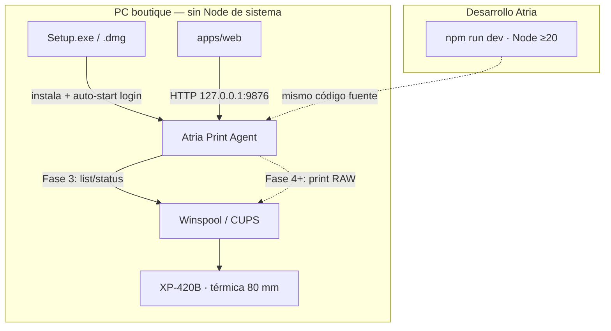

# Atria Print Agent — Arquitectura

**Cliente:** Boutique L'Scala (Calama) · **Proveedor:** Atria Solutions SpA  
**Fase documentada:** **3** — health + listado/status real de impresoras; **sin** impresión RAW aún  
**Fuente de análisis:** [`docs/qz-tray-analysis.md`](./qz-tray-analysis.md)  
**Código:** carpeta hermana `atria-print-agent/` (implementado con `dev-platform`)

---

## 1. Propósito

Puente local entre la SPA L'Scala (`apps/web`) y el spooler del SO:

- La web **sigue generando** TSPL (`buildLabelTspl`) y markup de comprobantes.
- El Agent **solo transporta** jobs a la impresora nombrada (RAW primero; HTML raster después).
- Sustituye QZ Tray en cutover **sin** dual-stack.

**Estado Fase 3:** descubierta de colas + status OK; `POST /print*` responde **501**.

---

## 2. Diagrama del sistema



`apps/api` (Express) **no** participa en la impresión de piso.

---

## 3. Ubicación en el repo

| Path | Rol |
|------|-----|
| `atria-print-agent/` | Paquete Node+TS **hermano** (no workspace npm de L'Scala por ahora) |
| `atria-print-agent/assets/atria-logo.png` | Logo canónico Agent (Dock/DMG; alpha) |
| `atria-print-agent/assets/tray-icon*.png` | Tray menu bar (alpha derivado) |
| `apps/web` | Cliente futuro `atriaPrintClient.ts`; hoy sigue QZ |
| `docs/atria-print-agent-*.md` | Contratos vivos |

No está en `package.json` `workspaces` del monorepo (evita acoplar builds). Desde raíz: `npm run dev:print-agent` (si está cableado).

Estructura (Fase 3):

```text
atria-print-agent/
  assets/atria-logo.png (+ tray-icon*.png)
  package.json
  src/
    main.ts
    config/
    server/                 # /health, /printers, /printers/:name/status, /print* 501
    security/
    jobs/                   # cola (jobs registrados aunque print sea 501)
    printer/
      printer.interface.ts
      commandRunner.ts      # spawn CLI sin deps nativas
      index.ts              # factory por platform
      windows/              # PowerShell Win32_Printer
      macos/                # lpstat EN+ES
    logging/
  packaging/                # (Fase 4+) Inno / DMG
```

---

## 4. Runtime y bind

| Constante | Valor | Notas |
|-----------|-------|--------|
| Host | `127.0.0.1` | Nunca `0.0.0.0` por defecto |
| Puerto | `9876` | Fijo para SPA y docs |
| Protocolo | HTTP JSON | Sin TLS en loopback |
| Datos usuario | Win `%APPDATA%\AtriaPrintAgent\` · macOS `~/Library/Application Support/AtriaPrintAgent/` | `config.json`, `logs/` |

Detalle de auth/CORS: [`atria-print-agent-security.md`](./atria-print-agent-security.md).

---

## 5. Contratos TypeScript de la API

Canónicos en `atria-print-agent/src/printer/printer.interface.ts` + rutas en `src/server/routes.ts`.

```ts
/** GET /health */
export type HealthResponse = {
  ok: true;
  status: 'ok';
  name: string;          // "Atria Print Agent"
  agent: string;         // alias
  version: string;
  agentId: string;
  platform: NodeJS.Platform;
  host: string;          // "127.0.0.1"
  port: number;          // 9876
};

export type PrinterStatus =
  | 'idle'
  | 'printing'
  | 'paused'
  | 'offline'
  | 'error'
  | 'unknown';

export type PrinterSource = 'stub' | 'cups' | 'winspool';

/** Elemento de GET /printers y cuerpo de GET /printers/:name/status */
export type PrinterInfo = {
  name: string;
  status: PrinterStatus;
  isDefault: boolean;
  source: PrinterSource;
  /** Opcional: usb | network | local | … */
  type?: string;
};

export type PrintersResponse = {
  printers: PrinterInfo[];
  platform: NodeJS.Platform;
  source: PrinterSource; // del primer ítem o fallback cups/winspool/stub
};

export type PrinterStatusResponse = {
  printer: PrinterInfo;
};

/** POST /print/raw — contrato; hoy 501 */
export type PrintRawRequest = {
  printer: string;
  data: string;
  encoding?: 'utf8' | 'base64';
  jobName?: string;
};
```

### Rutas HTTP (estado real)

| Método | Path | Auth | Estado |
|--------|------|------|--------|
| `GET` | `/health` | Abierto | **OK** |
| `GET` | `/printers` | Token si configurado | **OK** — lista real |
| `GET` | `/printers/:name/status` | Token si configurado | **OK** — detalle; `404 PRINTER_NOT_FOUND` |
| `POST` | `/print/raw` | Token si configurado | RAW/TSPL → spooler |
| `POST` | `/print/html` | Token si configurado | HTML→ESC/POS→RAW (sample:true = prueba corta) |
| `POST` | `/print` | Token si configurado | Alias raw o html según `format` |

Errores JSON: `{ error: string, message?: string }` (p.ej. `401 UNAUTHORIZED`, `404 PRINTER_NOT_FOUND`).

Header: `X-Atria-Print-Token: <secret>` (ver security).

### Encodear nombres en URL

`:name` puede tener espacios o caracteres especiales. El servidor hace `decodeURIComponent`. El cliente **debe** encodear:

```bash
# Ejemplo boutique — cola Xprinter XP-420B
curl -s "http://127.0.0.1:9876/printers/$(python3 -c 'import urllib.parse; print(urllib.parse.quote("Xprinter_XP-420B"))')/status" | jq
```

En JS: `` `/printers/${encodeURIComponent(name)}/status` ``.

---

## 6. PrinterAdapter (Win / Mac) — Fase 3

```ts
export interface PrinterAdapter {
  readonly platform: NodeJS.Platform;
  listPrinters(): Promise<PrinterInfo[]>;
  getPrinterStatus(name: string): Promise<PrinterInfo>;
  printRaw(job: PrintRawJob): Promise<PrintResult>; // aún no usado por HTTP (501)
}
```

Las rutas HTTP **no** hacen `if (win32)`: solo hablan con la interfaz.

| Plataforma | Backend Fase 3 (list/status) | Print RAW |
|------------|------------------------------|-----------|
| `darwin` | **CUPS CLI** `lpstat -p` / `-d` / `-v` — parser **EN + ES** | Fase 5 (`lp -o raw` / binding) |
| `win32` | **PowerShell** `Get-CimInstance Win32_Printer` | Fase 4 (Winspool RAW / nativo) |
| otro | stub / error claro | — |

### Decisión: sin deps nativas npm en Fase 3

No se usan `@luckykiet/node-printer`, `@maxxuxx/node-printer`, etc. Solo CLI del SO vía `child_process` (`commandRunner.ts`).

| Motivo | Detalle |
|--------|---------|
| Empaquetado | Evita node-gyp / prebuilds rotos en Setup.exe |
| Boutique | Win no requiere Visual Studio Build Tools solo para listar |
| macOS | `lpstat` viene con el SO |

Candidatos nativos MIT se **re-evalúan en Fase 4** para `printDirect` RAW. Plan B impresión: TCP 9100. Ver análisis QZ §12.2.

**Importante:** el Agent **no** regenera TSPL ni rediseña etiquetas 50×25.

---

## 7. Cola de jobs

- Módulo `jobs/` presente; en Fase 3 los `POST /print*` encolan y marcan `UNSUPPORTED` antes del 501.
- Serialización real de spooler: Fase 4+ (paridad con `labelPrintChain` de `qzTray.ts`).
- Dedup de etiquetas puede seguir en la SPA.

---

## 8. Cutover desde QZ (sin dual-stack)

1. Agent con `/health` + `/printers` (**hecho**) + `/print/raw` validado en HW.
2. SPA: cliente HTTP; `PrinterPrefsCard` → Agent.
3. Retirar `qz-tray`, `jsrsasign`, `qz-signing/` (Fase 8).
4. **No** dual-stack QZ en la transición.

Hasta el cutover, QZ sigue en L'Scala.

---

## 9. Empaquetado (requisito duro)

| OS | Artefacto | Auto-start | Runtime boutique |
|----|-----------|------------|------------------|
| Windows | `AtriaPrintAgent-Setup.exe` (Inno) | `HKCU\...\Run` o Inicio | pkg/SEA o Node embebido — **sin** Node de sistema |
| macOS | `.dmg` → `.app` | LaunchAgent `com.atria.print-agent` | Idem |

- **No** Windows Service como default.
- Electron **solo Plan C**.
- Logo: `atria-print-agent/assets/atria-logo.png` (canónico); tray: `tray-icon*.png`.

---

## 10. UI del Agent

| Pieza | Decisión |
|-------|----------|
| Prefs de impresora | Solo en SPA L'Scala |
| `GET /health` + `/printers` en `PrinterPrefsCard` | Obligatorio (Fase 6 wire) |
| Tray mínima | Recomendado, sin Electron |
| Settings del Agent | No |

---

## 11. Fuera de alcance (aún)

- Impresión RAW / HTML real (Fases 4 / 5 / 7).
- Eliminar QZ.
- Cambiar `buildLabelTspl`.
- Notarización / Authenticode.

---

## 12. Documentos relacionados

| Doc | Contenido |
|-----|-----------|
| [`qz-tray-analysis.md`](./qz-tray-analysis.md) | Auditoría QZ + instalable |
| [`atria-print-agent-security.md`](./atria-print-agent-security.md) | Token, CORS, logs |
| [`atria-print-agent-development.md`](./atria-print-agent-development.md) | `npm run dev`, curl Fase 3 |
| [`atria-print-agent-installation.md`](./atria-print-agent-installation.md) | UX instalador + logo |
| `atria-print-agent/README.md` | Runbook corto del paquete |
