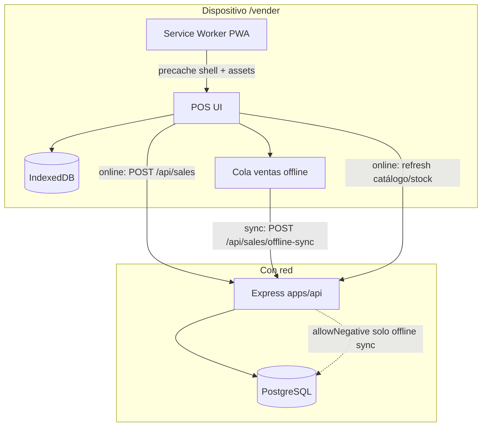

# PWA + venta offline — solo Caja (POS)

**Cliente:** Boutique L'Scala (Calama) · **Proveedor:** Atria Solutions SpA  
**Alcance:** offline **únicamente** en `/vender`. Resto de módulos: online obligatorio.  
**Alineación:** ATR-DIAG-001 — stock por `branch_id`, venta con `pos_id` + vendedora, movimiento trazable.

> Estado: **Fase A + B + C** (PWA + cache Caja + cola sync offline).
> Install: [`pwa-install.md`](./pwa-install.md).
> **Migración requerida:** `db/migrations/019_sales_client_sale_id.sql` — desde la raíz del monorepo ejecuta `npm run db:migrate` antes de probar sync.

---

## 1. Objetivo

Permitir que la vendedora cobre en Caja cuando cae la red (Wi‑Fi inestable en piso), usando catálogo/stock **cacheados** de la sucursal activa, encolando ventas localmente y sincronizándolas al volver la conexión.

**Regla de conflicto (única, cerrada por el usuario):**

> Si al sincronizar una venta offline el servidor detecta stock insuficiente → **permitir stock negativo**. Solo en ese caso (ventas offline sincronizadas). Online sigue rechazando sobrestock (`Stock insuficiente`).

---

## 2. Arquitectura



### Componentes

| Pieza | Rol |
|-------|-----|
| **Service Worker** (Vite PWA) | App shell instalable; cache de estáticos; **no** cachear mutaciones de otros módulos como verdad |
| **IndexedDB** | Catálogo + stock por `branch_id`; metadatos de sync; cola de ventas pendientes |
| **Cola local** | Ventas creadas sin red, con `clientSaleId` (UUID) idempotente |
| **Sync worker** (cliente) | Al detectar `online`, drena la cola hacia la API en orden FIFO |
| **API** | Endpoint de sync (batch o 1×1) que crea `sales` + `sale_items` + `inventory_movements` y **permite negativos** solo con flag offline |

### Flujos

1. **Con red:** comportamiento actual — `POST /api/sales` → `applyStockDelta` **sin** negativos; UI bloquea carrito si `qty > stock` cacheado/API.
2. **Sin red en `/vender`:** banner “Sin conexión — las ventas se guardarán y se enviarán al volver la red”; vender contra IDB; restar stock **local**; encolar.
3. **Vuelve la red:** sync cola → servidor; si stock servidor insuficiente → **negativo permitido**; toast resumen (N ok / errores no-stock).
4. **Sin red fuera de `/vender`:** navegación bloqueada o pantalla “Se necesita conexión para este módulo” (no silent fail).

---

## 3. Qué se cachea

### 3.1 Catálogo / stock (lectura)

Snapshot por sucursal activa (`branch_id`) + organización:

| Campo | Uso POS |
|-------|---------|
| `product.id`, `name`, `internal_code`, `barcode` | Búsqueda / scan |
| `sale_price`, `brand`, `size_label`, `color` | Ticket / UI |
| `photo_url` (opcional, thumb) | Stage; degradar a placeholder si no hay blob |
| `stock` (qty en `inventory_balances` de la branch) | Tope local online-like |
| `allows_exchange` / `allows_return` | Vouchers al sync (misma lógica servidor) |
| `tracks_stock` | Si no trackea, no restar local |

**Origen de datos (online):**

- Preferir endpoint dedicado liviano, p.ej. `GET /api/sales/pos-catalog?branchId=…` (o reutilizar `GET /api/products` con stock de branch + paginación completa / cursor).
- Refresco: al abrir `/vender`, al volver `online`, y cada N minutos mientras hay red (p.ej. 5–15 min).
- Al cambiar sucursal/POS: invalidar snapshot de la branch anterior; **no vender offline** hasta tener cache fresco de la branch nueva (mensaje claro).

**Límite práctico Calama:** catálogo de boutique (cientos, no millones). Si crece: paginar sync incremental por `updated_at`.

### 3.2 Auth / sesión

Hoy: JWT en `localStorage` (`lscala_token`), expiración típica **`12h`** (`JWT_EXPIRES_IN`). Branch/POS en `localStorage`.

**Estrategia (defaults del plan):**

1. **Antes de depender del offline:** la usuaria debe haber iniciado sesión **con red** (token válido en dispositivo).
2. **Durante offline:** usar el JWT vigente; si expira mid-offline, la cola **permanece** en IDB; al volver online, si 401 → pedir re-login y **reintentar sync** (no perder cola).
3. **Fase B/C recomendada:** `POST /api/auth/refresh` (o token de sesión más largo solo para dispositivos de caja) documentado; **no** meter secretos en el SW.
4. Guardar en IDB (no solo memoria): `userId`, `branchId`, `posId`, `organizationId` asociados a la cola para no mezclar sucursales.

**No cachear** contraseñas. Logout limpia cola solo con confirmación si hay pendientes.

### 3.3 Qué NO se cachea como verdad offline

Ingresos, inventario (ajustes), mermas, gastos, admin, reportes, historial remoto. Shell PWA puede precachear rutas estáticas, pero la **lógica de negocio** de esos módulos exige red.

---

## 4. API necesaria

### 4.1 Extensión de stock

Hoy `applyStockDeltaWithClient` lanza `400 Stock insuficiente` si `next < 0`.

Necesario:

```ts
allowNegative?: boolean  // true solo desde sync offline de ventas
```

- Online `POST /api/sales`: `allowNegative = false` (igual que hoy); bloqueo **en app** antes de persistir.
- Sync offline: `allowNegative = true` **únicamente** para deltas `SALE_OUT` de ese flujo.
- **Migración 020:** dropea CHECKs `quantity >= 0` / `quantity_after >= 0` de `006` para que el sync offline pueda persistir balances negativos.
- Movimiento: dejar `notes` o `reference` auditable, p.ej. `offline_sync` / `client_sale_id=…`.
- Inventario/UI: mostrar stock negativo con badge (fase post-sync; dueña ve quiebre real).

### 4.2 Idempotencia

Cada venta offline lleva **`clientSaleId`** (UUID v4 generado en el cliente).

- Tabla sugerida: `sale_sync_keys (organization_id, client_sale_id UNIQUE)` → `sale_id`, o columna `sales.client_sale_id` UNIQUE parcial.
- Reintento de sync: si la key existe → devolver la venta ya creada (200/201 idempotente), **no** duplicar stock.

### 4.3 Endpoint sync (recomendado)

`POST /api/sales/offline-sync`

```json
{
  "sales": [
    {
      "clientSaleId": "uuid",
      "posId": "uuid",
      "soldAt": "2026-08-10T18:22:00.000Z",
      "notes": "Venta offline",
      "items": [
        { "productId": "uuid", "quantity": 1, "unitPrice": 29990 }
      ]
    }
  ]
}
```

**Comportamiento:**

- Auth + `X-Branch-Id` como hoy; `posId` debe pertenecer a la branch.
- Procesar en orden; por ítem: crear sale/items/vouchers (mismas reglas de cambio) + `applyStockDelta(..., allowNegative: true)`.
- Respuesta por ítem: `{ clientSaleId, status: 'created'|'duplicate'|'error', saleId?, error? }`.
- Transacción **por venta** (no todo el batch en una sola TX) para no perder el lote entero por un producto inválido.
- `soldAt` del cliente: persistir si el schema lo permite (auditoría de piso); si no, `sold_at = now()` y guardar `soldAt` en notes/metadata.

**Alternativa mínima:** extender `POST /api/sales` con `clientSaleId` + `offline: true` → mismo `allowNegative`. Batch sigue siendo preferible para drenar cola.

### 4.4 Catálogo POS (opcional pero útil)

`GET /api/products/pos-snapshot` o query en products: todos los vendibles de la org con `stock` de branch, campos mínimos, `ETag` / `updatedSince` para refresh barato.

---

## 5. UX

### 5.1 Banner Caja

- Offline: barra fija no bloqueante — **“Sin conexión. Las ventas se guardan en este equipo y se envían al volver la red.”**
- Sync en curso: “Enviando ventas pendientes (3)…”
- Error de sync (no stock-related): “No se pudo enviar una venta — reintentar” + detalle.
- Stock local agotado: mismo criterio que hoy (no vender más de cache) **en cliente**; el servidor igual puede ir a negativo si otra caja vendió o el cache estaba viejo.

### 5.2 Install PWA

- `manifest.webmanifest`: nombre “L’Scala Caja”, iconos marca fucsia, `display: standalone`, `start_url: /vender` (o `/` con deep-link).
- Prompt de instalación en desktop/Android cuando aplique; iOS: guía “Agregar a inicio” (limitaciones SW).
- Criterio: Caja usable a pantalla completa en tablet de piso.

### 5.3 Bloqueo otros módulos offline

- Detector `navigator.onLine` + probe ligero a `/api/health` o `/api/auth/me` (evitar falsos offline).
- Si offline y ruta ≠ `/vender` (y ≠ `/login`): pantalla única “Este módulo necesita internet” + CTA “Ir a Caja” / “Reintentar”.
- AppShell: deshabilitar nav a módulos online-only con tooltip/copy claro.

### 5.4 Cola visible (mínimo)

- Indicador en Caja: “N ventas por sincronizar”.
- Tras sync OK: toast “Se enviaron N ventas”; limpiar de IDB.
- No exigir impresión offline en móvil; en PC el Agent puede seguir en localhost.

### 5.5 Copy (Chile, sin voseo)

Ejemplos: “Sin conexión”, “Se enviarán al volver la red”, “Stock en este equipo: N”, “Hay ventas pendientes de enviar”.

---

## 6. Riesgos

| Riesgo | Mitigación |
|--------|------------|
| Stock negativo “invisible” | Badge en Inventario/Productos; alerta stock bajo ya cubre ≤ umbral; opcional filtro “negativos” post-MVP |
| JWT expirado con cola llena | Cola durable; re-login + retry; no borrar pendientes |
| Cache desfasado (vende de más en local) | Sync con negativos; refresco agresivo al online; no alargar offline días |
| Duplicar ventas al reintentar | `clientSaleId` UNIQUE |
| Vender en branch A con cache de B | Clave IDB por `branchId`; gate al cambiar sucursal |
| SW sirve HTML viejo | `vite-plugin-pwa` skipWaiting + reload controlado en deploy |
| iOS PWA flaky | Documentar; priorizar Android/tablet Chrome y desktop |
| Vouchers offline | Generar en servidor al sync (no números locales definitivos) |
| Multi-caja misma prenda offline | Ambos sync → negativo; dueña reconcilia (regla aceptada) |

---

## 7. Fases de implementación

### Fase A — PWA instalable (sin offline de ventas) ✅

**Owners:** `dev-frontend` (+ `dev-platform` si HTTPS/headers)

- `vite-plugin-pwa`: manifest, icons marca, SW precache de assets.
- HTTPS en entorno real (requisito install).
- Banner/detector online básico (aún sin cola).
- Doc install: [`pwa-install.md`](./pwa-install.md).

**Done when:** se puede “Instalar L’Scala”; app abre en standalone; `/vender` carga shell desde cache tras visita previa.

### Fase B — Cache de lectura (catálogo/stock) ✅

**Owners:** `dev-backend` (snapshot) + `dev-frontend` (IDB)

- `GET /api/sales/pos-snapshot` + IndexedDB por `branchId`.
- Al entrar a Caja online: persistir IDB; refresh al volver online.
- Offline en `/vender`: buscar/escanear desde IDB; finalizar encola venta (Fase C).
- Bloqueo de otros módulos offline (`RequireOnline`).

**Done when:** sin red, Caja muestra productos/stock cacheados; otros módulos muestran mensaje de red.

### Fase C — Cola de ventas + sync con negativos ✅

**Owners:** `dev-backend` (allowNegative + offline-sync + idempotency) + `dev-frontend` (cola + UI)

- Finalize offline → `enqueueOfflineSale` + UUID `clientSaleId` + stock local optimista.
- Sync FIFO al volver online / al abrir Caja → `POST /api/sales/offline-sync`.
- `created` / `duplicate` se quitan de la cola; `error` se reintenta; **401** conserva la cola hasta re-login.
- Banner: “X ventas pendientes de sincronizar” + estado enviando.
- Inventario online: badge danger si `qty < 0` (solo posibles vía offline-sync).
- Negativos **solo** en offline-sync; venta online sigue bloqueando sobrestock.

**Done when:** criterios de aceptación §8 en verde.

### Orden sugerido

`A → B → C`. Completado en producto.

---

## 8. Criterios de aceptación

1. Offline **solo** afecta Caja (`/vender`); resto exige red con mensaje claro.
2. Con red: venta idéntica a hoy (sin negativos por venta online).
3. Sin red: banner visible; se puede vender con catálogo cacheado de la **sucursal activa**.
4. Ventas offline quedan en cola local hasta sync exitoso; sobreviven reload.
5. Al volver la red, la cola se envía; no hay tickets duplicados (idempotencia).
6. Si el servidor no tiene stock suficiente al sync → **stock negativo permitido** y movimiento/venta creados.
7. JWT expirado: re-login no pierde la cola; sync completa después.
8. Cambio de sucursal: no se mezclan colas ni caches entre branches.
9. PWA instalable en al menos un target de piso acordado (Android Chrome y/o desktop).
10. Trazabilidad: venta + movimiento con vendedora, branch, pos; origen offline auditable.
11. Impresión no bloquea el flujo offline (Agent = nice-to-have en PC).

---

## 9. Relación con el diagnóstico

| Principio ATR-DIAG-001 | Offline POS |
|------------------------|-------------|
| Stock por sucursal | Cache y cola scoped por `branch_id` |
| Venta con POS + vendedora | `posId` + JWT user en cada ítem de cola |
| Movimiento auditable | `SALE_OUT` al sync; notes/offline flag |
| Compra → recepción → stock | Sin cambios; offline no crea ingresos |
| Negativos | Excepción **solo** sync offline (acuerdo de producto) |

---

## 10. Referencias repo

- UI: `apps/web/src/pages/PosPage.tsx` → online `POST /api/sales`; offline cola + `POST /api/sales/offline-sync`
- Cola IDB: `apps/web/src/lib/posCatalogCache.ts` · sync: `apps/web/src/lib/offlineSalesSync.ts`
- Stock: `apps/api/src/services/inventory.ts` → guard `next < 0` (online); allowNegative solo offline-sync
- Auth: JWT ~12h · `lscala_token` / `lscala_branch` / `lscala_pos`
- Print Agent: `docs/atria-print-agent-architecture.md` (loopback; independiente de WAN)
- Migración: `npm run db:migrate` (`019_sales_client_sale_id.sql`)
