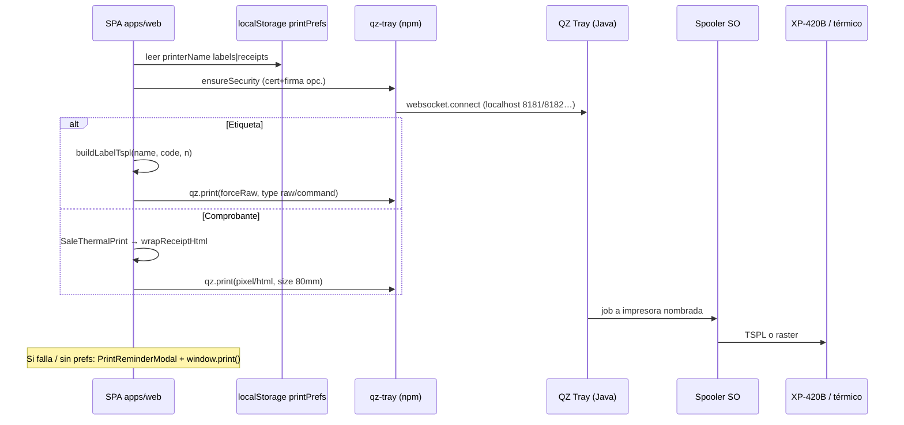
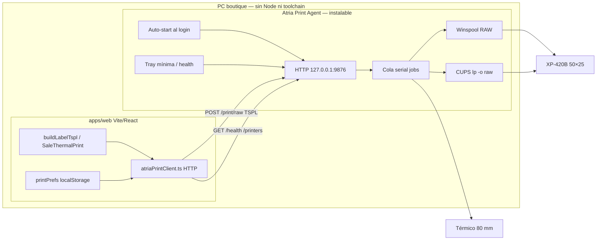

# Auditoría QZ Tray → propuesta Atria Print Agent

**Cliente:** Boutique L'Scala (Calama) · **Proveedor:** Atria Solutions SpA  
**Alcance:** Fase 1 — solo análisis. **Sin implementación.**  
**Fecha:** 2026-08-10  
**Estado app:** solo local / desarrollo; impresión actual funciona.

---

## 1. Resumen ejecutivo

Hoy la SPA Vite (`apps/web`) habla con **QZ Tray** (proceso Java local) vía WebSocket. Dos perfiles:

| Perfil | Formato | Destino típico |
|--------|---------|----------------|
| **Etiquetas** | **TSPL raw** (comandos texto) | Xprinter XP-420B · 50×25 mm |
| **Comprobantes** | **HTML pixel** (rasterizado por QZ) | Térmico 80 mm |

La generación de etiquetas TSPL (`buildLabelTspl`) y el markup de comprobantes viven en el frontend y **deben reutilizarse**. Lo que se reemplaza es la **capa de transporte** (cliente `qz-tray`, firma/certs, diálogos Allow).

Propuesta: **Atria Print Agent** = proceso **Node.js + TypeScript** empaquetado (sin Electron como runtime de producto), HTTP en `127.0.0.1:9876`, que recibe TSPL/bytes (y más adelante HTML/PDF) y los envía al spooler (Windows Winspool RAW / macOS CUPS).

### Requisitos duros de producto (instalable) — feedback usuario

Entregable final en PC de boutique L'Scala = **instalable**, no un proyecto Node:

| Requisito | Obligatorio |
|-----------|-------------|
| Windows: **Setup.exe** (o MSI) | Sí |
| macOS: **.dmg** (o .pkg) que deje `.app` en Applications | Sí |
| Usuario final **NO** instala Node.js | Sí |
| Usuario final **NO** levanta el servicio a mano tras reiniciar | Sí |
| Tras instalar: Agent **arranca solo al iniciar sesión** | Sí |
| Flujo: instalar → (opcional reiniciar) → imprimir desde L'Scala | Sí |

Detalle de empaquetado, auto-start, UI mínima y criterios de aceptación: **§12.7–§12.10**.

**Fase 2 (diseño):** ver  
[`atria-print-agent-architecture.md`](./atria-print-agent-architecture.md) ·  
[`atria-print-agent-security.md`](./atria-print-agent-security.md) ·  
[`atria-print-agent-development.md`](./atria-print-agent-development.md) ·  
[`atria-print-agent-installation.md`](./atria-print-agent-installation.md)  
(logo: `atria-print-agent/assets/atria-logo.png`).

**Siguiente paso:** Fases 3+ (health/printers real, print RAW) tras aprobación — **sin** eliminar QZ aún.

---

## 2. Inventario de archivos relacionados con QZ / impresión

### 2.1 Núcleo QZ (transporte + TSPL)

| Ruta | Rol |
|------|-----|
| `apps/web/src/lib/qzTray.ts` | Conexión WS, firma, listado impresoras, `buildLabelTspl`, `printLabelTsplViaQz`, `printHtmlViaQz`, `tryQzPrint*` |
| `apps/web/src/types/qz-tray.d.ts` | Tipado manual del módulo `qz-tray` |
| `apps/web/src/lib/printPrefs.ts` | Prefs locales (`localStorage`), flag `QZ_TRAY_ENABLED`, perfiles `labels` / `receipts` |
| `apps/web/public/qz-signing/README.txt` | Instrucciones para cert/key demo de QZ |
| `apps/web/public/qz-signing/digital-certificate.txt` | Cert PEM (gitignored; no en repo) |
| `apps/web/public/qz-signing/private-key.pem` | Clave privada (gitignored; no en repo) |

### 2.2 UI de preferencias y fallback navegador

| Ruta | Rol |
|------|-----|
| `apps/web/src/components/PrinterPrefsCard.tsx` | Detectar QZ, listar impresoras, guardar prefs |
| `apps/web/src/components/PrintReminderModal.tsx` | Recordatorio antes de `window.print()` |
| `apps/web/src/pages/admin/AdminEquipoPage.tsx` | Monta `PrinterPrefsCard` en `/admin/equipo` |
| `apps/web/src/pages/admin/AdminLayout.tsx` | Copy de pestaña Equipo (impresoras) |

### 2.3 Call sites de impresión

| Ruta | Qué imprime |
|------|-------------|
| `apps/web/src/pages/ingresos/IngresoDetailPage.tsx` | Etiquetas vía `tryQzPrintLabel`; fallback DOM + `PrintReminderModal` + `window.print()` |
| `apps/web/src/components/NoBarcodeModal.tsx` | Dispara flujo de N etiquetas (no habla QZ directo; lo hace el padre) |
| `apps/web/src/lib/useSalePrint.ts` | Comprobantes: `wrapReceiptHtml` + `tryQzPrint('receipts')`; fallback modal |
| `apps/web/src/pages/PosPage.tsx` | Usa `useSalePrint` + `SaleThermalPrint` |
| `apps/web/src/pages/SalesHistoryPage.tsx` | Idem reimpresión |

### 2.4 Generación visual / contenido (reutilizable; no es transporte QZ)

| Ruta | Rol |
|------|-----|
| `apps/web/src/lib/salePrint.ts` | Constantes negocio, tipos de job de venta, anchos 80 mm |
| `apps/web/src/components/SaleThermalPrint.tsx` | Markup React del comprobante |
| `apps/web/src/components/ThermalBarcode.tsx` | Code128 (JsBarcode) para fallback etiqueta y vouchers |

### 2.5 Dependencias npm

| Paquete | Dónde | Uso |
|---------|-------|-----|
| `qz-tray` `^2.2.6` | `apps/web/package.json` | Cliente JS → QZ Tray (LGPL-2.1) |
| `jsrsasign` `^11.1.3` | idem | Firma SHA512withRSA de requests QZ |
| `jsbarcode` `^3.12.3` | idem | Barras en HTML/fallback (no en path TSPL) |

Lockfile: `package-lock.json` → `node_modules/qz-tray@2.2.6`.

**Scripts npm:** no hay script dedicado a QZ/impresión (solo `dev` / `build` de web). QZ Tray se instala **fuera** del monorepo (binario de escritorio).

### 2.6 API (`apps/api`)

**Sin** rutas ni servicios de impresión, TSPL ni QZ. Toda la impresión es **cliente → QZ Tray en el mismo PC**.

### 2.7 Docs / ignore / tests

| Ruta | Nota |
|------|------|
| `.gitignore` | Ignora `qz-signing/private-key.pem` y `digital-certificate.txt` |
| `docs/runbooks/e2e-responsive.md` | QZ / impresión física fuera de alcance e2e |
| `docs/entrega.md`, `docs/qa-checklist.md` | Mencionan impresión física como pendiente/HW |
| `tests/e2e/support/audit.ts` | Ignora ruido `qz-tray` en consola |
| `README.md` | Sin sección QZ (gap) |

### 2.8 Función no usada hoy

`buildLabelHtml()` en `qzTray.ts` (~L354) genera HTML 50×25 con JsBarcode, pero **ningún call site** la invoca. El fallback de etiquetas monta `.ing-label-print` + `ThermalBarcode` y llama `window.print()`.

---

## 3. Cómo funciona hoy (flujo)



---

## 4. Conexión a QZ

**Archivo:** `apps/web/src/lib/qzTray.ts`

1. `ensureSecurity()` registra `qz.security.setCertificatePromise` y `setSignaturePromise` (SHA512).
2. `connectQz()`:
   - exige `QZ_TRAY_ENABLED === true` (`printPrefs.ts`);
   - deduplica con `connectPromise`;
   - `qz.websocket.connect({ retries: 2, delay: 0.5 })`.
3. Detección: `qz.websocket.isActive()`.
4. Puertos por defecto del producto QZ (no override en código): WSS `8181/8282/…`, WS `8182/8283/…` en `localhost`.

Evidencia:

```117:148:apps/web/src/lib/qzTray.ts
export async function connectQz(): Promise<void> {
  if (!QZ_TRAY_ENABLED) {
    throw new Error('QZ Tray no está habilitado en esta versión');
  }
  ensureSecurity();
  // ...
  connectPromise = qz.websocket
    .connect({ retries: 2, delay: 0.5 })
    // ...
```

---

## 5. Detección de impresoras

`listQzPrinters()` → `connectQz()` + `qz.printers.find()`, normaliza string o `{ name }`.

UI: `PrinterPrefsCard.detectPrinters()` / efecto al montar → select o input libre si no hay lista.

---

## 6. Selección de impresora (prefs)

**Storage:** `localStorage` clave `lscala_print_prefs_v1`.

```17:39:apps/web/src/lib/printPrefs.ts
export type PrintPrefs = {
  labels: PrintProfile;
  receipts: PrintProfile;
  preferQzWhenAvailable: boolean;
};
export const QZ_TRAY_ENABLED = true;
// ...
preferQzWhenAvailable: true,
```

- Dos nombres exactos de impresora SO: `labels.printerName`, `receipts.printerName`.
- `preferQzWhenAvailable`: si false, `tryQzPrint*` falla de inmediato y la UI usa el diálogo del navegador.
- Evento `lscala:print-prefs` para sincronizar UI.

---

## 7. Generación del trabajo

### 7.1 Etiquetas (path feliz = TSPL en el navegador)

**Quién:** `buildLabelTspl(name, code, copies)` en `qzTray.ts` (exportada).

- DPI 203; `SIZE 50 mm,25 mm`; `GAP 2 mm,0`; `DIRECTION 1`; `CLS`; `TEXT` (font built-in); `BARCODE "128"`; `PRINT n,1`.
- Nombre ASCII-safe (`toTsplSafe`); hasta 2 líneas; centrado horizontal/vertical.
- **Un solo job** con N copias en `PRINT n,1` (no N llamadas a `qz.print`).
- Cola serial + dedup 3 s (`labelPrintChain` / `labelPrintBusy`).

### 7.2 Etiquetas (fallback navegador)

`IngresoDetailPage.requestLabelPrint` → si QZ falla → `PrintReminderModal` → monta N `.ing-label-print` + `ThermalBarcode` → `window.print()`.

### 7.3 Comprobantes

1. React: `SaleThermalPrint` + datos `salePrint.ts`.
2. `useSalePrint` serializa `.sale-print-root.innerHTML`.
3. `wrapReceiptHtml` añade DOCTYPE + CSS ancho 76 mm.
4. QZ rasteriza HTML a 80 mm / 203 dpi.

---

## 8. Formato exacto (evidencia)

| Canal | Formato QZ | Evidencia |
|-------|-----------|-----------|
| Etiquetas (primario) | **RAW · comandos TSPL/TSPL2** (`type: 'raw'`, `format: 'command'`, `flavor: 'plain'`, `forceRaw: true`) | `printLabelTsplViaQz` L466–475 |
| Comprobantes (primario) | **Pixel HTML** (`type: 'pixel'`, `format: 'html'`, `flavor: 'plain'`) | `printHtmlViaQz` L505–511 |
| Fallback etiquetas | **HTML/CSS del DOM** + diálogo SO (`window.print`) — **no** pasa por QZ | `IngresoDetailPage` |
| Fallback comprobantes | Idem | `useSalePrint.browserPrint` |
| ZPL / EPL / PDF | **No usados** en código actual | — |
| Imagen binaria | No como payload principal | — |

Snippet TSPL enviado:

```338:350:apps/web/src/lib/qzTray.ts
  const cmds = [
    'SIZE 50 mm,25 mm',
    'GAP 2 mm,0',
    'DIRECTION 1',
    'REFERENCE 0,0',
    'SET TEAR ON',
    'CLS',
    ...nameCmds,
    `BARCODE ${barX},${barcodeY},"128",${barcodeH},0,0,${narrow},${wide},"${safeCode}"`,
    `TEXT ${codeX},${codeY},"1",0,1,1,"${safeCode}"`,
    `PRINT ${n},1`,
  ];
  return `${cmds.join('\r\n')}\r\n`;
```

Envío raw:

```466:475:apps/web/src/lib/qzTray.ts
      const tspl = buildLabelTspl(name, code, n);
      const config = qz.configs.create(printer, { forceRaw: true, encoding: null });
      await qz.print(config, [
        {
          type: 'raw',
          format: 'command',
          flavor: 'plain',
          data: tspl,
        },
      ]);
```

**Conclusión de formato:** mixto — **TSPL raw** (etiquetas) + **HTML pixel** (comprobantes) + **HTML navegador** (fallback). El Agent debe priorizar **bytes/texto RAW** para etiquetas; comprobantes requieren raster HTML→imagen/PDF o ESC/POS (fase posterior).

---

## 9. Envío del job a QZ

1. Resolver nombre de impresora (`getProfile` o override).
2. `qz.configs.create(printer, options)`.
3. `qz.print(config, data[])`.
4. APIs públicas de conveniencia: `tryQzPrintLabel` / `tryQzPrint` (respetan flag y prefs; errores humanizados).

---

## 10. Errores, firma anónima, certificados

### 10.1 Firma

- Assets servidos estáticos: `/qz-signing/digital-certificate.txt`, `/qz-signing/private-key.pem`.
- Con PEM válidos → `trustMode = 'signed'` (menos diálogos Allow).
- Sin assets o fallo de firma → `resolve(null/undefined)` → **anonymous**; **no se rechaza** la promise (evita abortar el job).
- Firma en **cliente** con `jsrsasign` (clave privada en `public/` del entorno local — aceptable solo en demo/dev; no para prod).

### 10.2 Errores UX

`humanizeQzError`: mensajes en español Chile (conexión, firma, impresora). Toasts en Ingresos/POS; fallback a navegador.

### 10.3 Dependencia externa

Hace falta **QZ Tray instalado y corriendo** en el PC. Cert demo: Site Manager → Create New (ver README en `qz-signing/`).

---

## 11. Qué reutilizar vs qué reemplazar

### Reutilizar (no rehacer diseño de etiqueta)

- `buildLabelTspl` (+ helpers `toTsplSafe`, layout dots, dedup de jobs).
- Modelo `printPrefs` / UI de dos perfiles (renombrar copy “QZ” → “Atria Print” en fases posteriores).
- `SaleThermalPrint`, `salePrint.ts`, `ThermalBarcode`, `PrintReminderModal` (fallback).
- Flujos de negocio: Ingresos N etiquetas, POS/historial comprobantes.
- Dimensiones 50×25 / 80 mm y política de negocio del voucher.

### Reemplazar (capa transporte QZ)

- Import `qz-tray` y `qzTray.ts` APIs de WS/print/list/security.
- `jsrsasign` + carpeta `qz-signing/` (solo sirven a QZ).
- Tipado `qz-tray.d.ts`.
- Copy/ayuda “Allow / Site Manager / anonymous”.
- Dependencia npm `qz-tray` (cuando se retire QZ; **no en Fase 1**).

### Adaptar (contrato fino)

- `tryQzPrintLabel` / `tryQzPrint` / `listQzPrinters` / `probeQzStatus` → cliente HTTP al Agent (`tryAgentPrintLabel`, etc.).
- `PrinterPrefsCard`: healthcheck Agent en lugar de `probeQzStatus`.
- Flag `preferQzWhenAvailable` → `preferAgentWhenAvailable` (o genérico).

---

## 12. Propuesta: Atria Print Agent

### 12.1 Tecnología del Agent (justificación)

| Opción | Pros | Contras | Decisión |
|--------|------|---------|----------|
| **Node.js + TypeScript** → **binario/instalable** (sin Node en el PC de boutique) | Alineado al stack Atria; HTTP trivial; empaquetable; mismo código en `npm run dev` | Bindings nativos Win/mac; hay que resolver auto-start | **Elegida (dev + producto)** |
| Electron como runtime de producto | Installers y tray maduros (`electron-builder`) | Pesado (~100+ MB), Chromium innecesario para un puente HTTP | **No primario**; solo Plan C de empaquetado (§12.7) |
| Servicio .NET / Go | Excelente spooler Windows | Segundo lenguaje; duplica stack | No, salvo bloqueo de bindings |

**Configuración de impresoras** sigue en la SPA L'Scala (`PrinterPrefsCard`). El Agent no es un panel de administración.

### 12.2 Windows — adaptador propuesto

Enviar **RAW** al spooler Win32 (`StartDocPrinter` / `WritePrinter`) con nombre de cola exacto (como hoy con QZ).

**Candidatas (sin instalar; evaluación documentada):**

| Paquete | Licencia | Notas / riesgo |
|---------|----------|----------------|
| `@maxxuxx/node-printer` | MIT | Winspool + CUPS + TCP; prebuilds; API joven, pocos downloads → **riesgo madurez** |
| `@luckykiet/node-printer` | MIT | Fork mantenido de `node-printer`; `printDirect({ type: 'RAW' })`; Node ≥20; puede requerir build tools | 
| `@nirbby/node-printer` | MIT | Otro fork; similar |
| `@ssxv/node-printer` | MIT | Winspool/CUPS; raw async; madurez media |
| Fallback sin native | — | `child_process` + herramientas SO (frágil) |

**Recomendación preliminar:** POC con **`@luckykiet/node-printer` o `@maxxuxx/node-printer`** en Windows con XP-420B; criterio de corte: prebuild estable en Node 20+, `printDirect`/`printRaw` TSPL idéntico al string actual. Si falla, evaluar TCP **9100** a la impresora (bypass spooler) como plan B.

### 12.3 macOS — enfoque propuesto

- Listar: `lpstat -p` / API CUPS del binding.
- Imprimir RAW: `lp -d <cola> -o raw` o `printDirect`/`cups` del mismo paquete cross-platform.
- Driver de la XP-420B debe aceptar raw TSPL (como con QZ); si el driver “renderiza”, forzar raw.

### 12.4 Dependencias candidatas del Agent (no instaladas)

| Dep | Uso | Licencia | Riesgo |
|-----|-----|----------|--------|
| `express` o `fastify` | HTTP local | MIT | Bajo |
| `zod` | Validar body | MIT | Bajo (ya en api) |
| Binding impresora (tabla §12.2) | Spooler | MIT | **Medio** (nativo) |
| Empaquetado + instalador (Inno/NSIS + DMG; ver §12.7) | Setup.exe / .dmg — **requisito duro** | varía | Medio–alto (CI, firma) |
| (Opcional) lib tray nativa liviana | Icono de estado sin Electron | MIT/varía | Bajo–medio |
| (Opcional) `puppeteer`/`playwright` en Agent | Raster HTML comprobantes | Apache-2.0 | Alto peso — **diferir** |

SPA: cliente `fetch` liviano; **sin** `qz-tray` / `jsrsasign` al final de la migración.

### 12.5 Comunicación L'Scala ↔ Agent

- **Bind:** solo `127.0.0.1:9876` (nunca `0.0.0.0` en default).
- **Protocolo:** HTTP JSON (simple para Vite/fetch).

Sketch de API:

```http
GET  /health                 → { ok, version, platform }
GET  /printers               → { printers: string[] }
POST /print/raw              → { printer, data: string|base64, encoding?: "utf8"|"base64", jobName? }
POST /print/html             → diferido (comprobantes) { printer, html, widthMm?: 80 }
```

**Security sketch (dev local):**

1. Bind loopback únicamente.
2. Header compartido opcional `X-Atria-Print-Token` (token en archivo local del Agent + prefs SPA) — anti-request de otras pestañas/orígenes si CORS mal puesto.
3. CORS: solo orígenes de Vite (`http://localhost:5173` / puerto conocido).
4. Sin TLS en loopback (aceptable en app solo-local); documentar en Fase 2 (`docs/` security).
5. Rate-limit simple / cola serial de jobs (como `labelPrintChain` hoy).
6. **No** exponer firma QZ ni claves en el Agent.

Contrato de etiquetas: el SPA sigue generando TSPL y envía el string; el Agent **no** rediseña la etiqueta.

### 12.6 Arquitectura definitiva propuesta



ASCII:

```
[Instalador Setup.exe / .dmg]
        │  (una vez)
        ▼
[Atria Print Agent]  ←── auto-start al iniciar sesión
   tray mínima + HTTP 127.0.0.1:9876
        ▲
        │ GET /health · POST /print/raw
[SPA L'Scala] buildLabelTspl / comprobantes
        │
   Winspool RAW / CUPS raw → XP-420B / térmica
```

`apps/api` Express **no** interviene en la impresión de piso.

### 12.7 Empaquetado e instalable (requisito duro)

El usuario de boutique **no es desarrollador**. El entregable de producto es:

- **Windows:** `AtriaPrintAgent-Setup.exe` (Inno Setup o NSIS).
- **macOS:** `AtriaPrintAgent.dmg` (o `.pkg`) que instala `Atria Print Agent.app` en `/Applications`.

Tras el setup: el Agent queda registrado para **arrancar solo al iniciar sesión**. Sin `node`, sin `npm`, sin terminal.

#### Modelo desarrollo vs producción

| Entorno | Quién | Cómo corre el Agent |
|---------|-------|---------------------|
| **Desarrollo** | Equipo Atria | `npm run dev` (o script del workspace Agent) con Node ≥20 en la máquina del dev; hot reload / logs en consola; sin instalador |
| **Producción (PC boutique)** | Dueña / vendedora | Solo el **instalable**; runtime embebido o binario; auto-start; sin toolchain |

El código fuente es el mismo; cambia el artefacto y el arranque.

#### Windows — recomendación primaria + Plan B

**Primaria: Inno Setup (Setup.exe) + binario/app empaquetada + auto-start en sesión de usuario (HKCU Run o carpeta Inicio)**

Pipeline propuesto:

1. Build del Agent (TypeScript → JS).
2. Empaquetar runtime:
   - Preferido: **`@yao-pkg/pkg`** (sucesor mantenido de `pkg`) o **Node SEA**, produciendo `atria-print-agent.exe`, con **addons nativos** (printer) como `.node` al lado del exe si el bundler no los embebe.
   - Si los prebuilds nativos pelean con pkg/SEA: el instalador copia una carpeta `runtime/` con **Node embebido** (node.exe oficial + `app/` + `node_modules` nativos) y un launcher `.exe`/`cmd` stub. El usuario **sigue sin** “instalar Node” a nivel sistema; solo archivos bajo Program Files.
3. **Inno Setup** genera `Setup.exe`: instala en `%LOCALAPPDATA%\Atria\PrintAgent` (o Program Files), crea acceso, escribe **auto-start**.
4. Auto-start **primario:** clave `HKCU\Software\Microsoft\Windows\CurrentVersion\Run` → path del Agent (mismo modelo mental que QZ Tray: app de usuario al login). Alternativa equivalente: acceso en carpeta Inicio del usuario.
5. **No** usar Windows Service (Session 0) como default: colas USB / impresoras de sesión de escritorio suelen fallar o complicarse; el Agent debe vivir en la sesión interactiva.

| Enfoque Win | Pros | Contras |
|-------------|------|---------|
| **Inno + exe/pkg o Node embebido + Run/Inicio** (**primaria**) | Setup.exe familiar; sin Node de sistema; auto-start simple; acceso a impresoras de usuario | Hay que probar nativos con el bundler; SmartScreen sin firma |
| Task Scheduler “At log on” (**Plan B auto-start**) | Sobrevive si políticas bloquean Run | Más opaco para soporte; hay que documentar |
| `node-windows` como servicio | Reinicio automático “de servicio” | Session 0 / impresoras; overkill; **no primario** |
| `electron-builder` NSIS solo por el instalador (**Plan C**) | Installers y auto-start muy maduros; tray fácil | Chromium pesado; solo si pkg/SEA+nativos fracasan en POC |

**Plan B de empaquetado Win:** si `@yao-pkg/pkg`/SEA no cargan el binding de impresión de forma fiable → **Node embebido en carpeta** dentro del Setup.exe (sin registro global de Node).  
**Plan C:** Electron headless/`electron-builder` solo como vehículo de instalador+tray (último recurso de peso).

#### macOS — recomendación primaria + Plan B

**Primaria: `.app` en `/Applications` + LaunchAgent (`RunAtLoad` + `KeepAlive`) + distribución DMG**

1. Bundle `Atria Print Agent.app` (`Contents/MacOS` = binario pkg/SEA o script + Node embebido; `Info.plist`).
2. Al instalar (o al primer arranque del .app), escribir  
   `~/Library/LaunchAgents/com.atria.print-agent.plist` con:
   - `ProgramArguments` → ejecutable del .app
   - `RunAtLoad` = true
   - `KeepAlive` = true (o reinicio si exit ≠ 0)
   - logs a `~/Library/Logs/AtriaPrintAgent/`
3. DMG: arrastrar a Applications (+ opcional script post-install del LaunchAgent).
4. **Notarización / firma Developer ID:** documentada como **fase posterior** (Gatekeeper puede pedir “Abrir de todos modos” en builds internos/dev). No bloquea el diseño del instalable.

| Enfoque Mac | Pros | Contras |
|-------------|------|---------|
| **.app + LaunchAgent + DMG** (**primaria**) | Estándar macOS; sobrevive logout/login; KeepAlive | Firma/notarización para UX limpia (después) |
| Solo Login Items (SMAppService / “Abrir al iniciar”) (**Plan B**) | UI nativa de Ajustes del Sistema | API varía por versión macOS; menos control KeepAlive |
| `.pkg` con scripts (**alternativa de distribución**) | Instala LaunchAgent de forma silenciosa | Más ceremonia de firma |

#### Qué no es aceptable en producción boutique

- Pedir `npm install` / `node atria-print-agent`.
- Documentar “abre una terminal y corre el Agent” tras cada reinicio.
- Depender de que la usuaria recuerde lanzar un acceso manual (salvo recuperación de soporte).

### 12.8 UI mínima / tray vs proceso invisible

Pregunta: ¿hace falta UI o proceso 100 % invisible?

**Recomendación: híbrido mínimo (sin Electron).**

| Capa | Rol | Obligatorio |
|------|-----|-------------|
| **`GET /health` desde L'Scala** (`PrinterPrefsCard`: Conectado / No detectado) | Respuesta diaria a “¿está corriendo?” en el mismo lugar donde se elige impresora | **Sí** |
| **Tray OS liviana** (icono menú: Estado, Abrir carpeta de logs, Salir) | Soporte en piso sin abrir la web; quitar el proceso a propósito | **Recomendado** en Win + Mac |
| Ventana de settings del Agent | Duplicaría prefs de la SPA | **No** |
| Electron solo por el tray | Peso injustificado | **No** (salvo Plan C §12.7) |

Implementación tray: librería nativa liviana compatible con el empaquetado (`systray` / equivalente), o stub de plataforma en el mismo proceso Node. Si el tray rompe el POC de empaquetado, **Plan B UX:** sin icono, solo LaunchAgent/Run + estado en la web + archivo de log en ruta fija documentada en runbook.

Proceso 100 % invisible **solo** es aceptable si el health en la SPA es claro y el auto-start es fiable; aun así se recomienda tray para paridad con “QZ Tray está abierto”.

### 12.9 Criterios de aceptación del instalador

Gate de producto (boutique), además de imprimir una etiqueta:

1. En un PC **sin** Node.js ni Git ni toolchain, ejecutar `AtriaPrintAgent-Setup.exe` (Win) o instalar desde `.dmg` (Mac) completa sin pasos de desarrollador.
2. Reiniciar el PC (o cerrar sesión y volver a entrar).
3. **Sin** abrir terminal ni lanzar el Agent a mano, `GET http://127.0.0.1:9876/health` responde OK (`{ ok: true, ... }`).
4. La SPA L'Scala muestra puente “Conectado” (o equivalente) y lista impresoras.
5. Imprimir al menos una etiqueta TSPL a la cola configurada.
6. Desinstalador (Win) / borrar .app + unload LaunchAgent (Mac) deja de escuchar el puerto (documentado en runbook Fase 8).

### 12.10 Implicación en fases

El instalable + auto-start **no es un “extra” de cierre**: es requisito de aceptación del Agent. El trabajo de empaquetado empieza en paralelo al print RAW (spike en Fase 4/5, endurecido en Fase 8), no se improvisa al final.

---

## 13. Riesgos técnicos

| Riesgo | Impacto | Mitigación |
|--------|---------|------------|
| Binding nativo vs Node 20+/arm64 | Agent no arranca | POC temprano Win + Mac; prebuilds; pin Node |
| Driver Windows “interpreta” TSPL | Etiqueta basura | Forzar RAW; probar cola; alternativa TCP 9100 |
| CUPS macOS sin `-o raw` | Idem | Documentar cola; flag raw explícito |
| Comprobantes HTML sin motor pixel de QZ | Voucher peor calidad | Fase posterior: raster en Agent o mantener `window.print` temporalmente **solo para receipts** |
| Puerto 9876 ocupado | Sin puente | Config + mensaje claro en UI |
| Pérdida de diálogos Allow de QZ | Menos fricción, pero menos “confirmación” | Token local + solo loopback |
| Migración sin dual-stack QZ | Corte limpio (pedido) | Checklist HW antes del cutover; rollback = reinstalar QZ + revert cliente |
| Clave QZ en `public/` | Solo problema mientras exista QZ | Eliminar en fase de retiro |
| **pkg/SEA no carga addon de impresión** | Instalable roto | Plan B: Node embebido en carpeta (§12.7); spike en Fase 4 |
| **Auto-start fallido tras reinicio** | “Hay que abrir el Agent a mano” — **incumple requisito duro** | Criterios §12.9; QA reinicio obligatorio; KeepAlive / Run verificado |
| SmartScreen / Gatekeeper sin firma | Miedo al instalar | Firma de código cuando haya certificado Atria; copy “Abrir de todos modos” en runbook interim |
| Windows Service (Session 0) mal elegido | No ve USB/impresoras | **Prohibido como default**; sesión de usuario |
| Tray nativa vs empaquetado | Icono ausente | Health en SPA obligatorio; tray es recomendado, no bloqueante |

---

## 14. Plan de fases (1–8)

| Fase | Objetivo | Entregable | Fuera de alcance |
|------|----------|------------|------------------|
| **1** | Auditar QZ y proponer Agent (+ requisitos instalable) | Este doc `docs/qz-tray-analysis.md` | Código, deps nuevas |
| **2** | Contratos + scaffold + logo | Docs `atria-print-agent-*.md` + scaffold `atria-print-agent/` + `assets/atria-logo.png` | Sustituir QZ en SPA; print real |
| **3** | Agent: health + list printers | Endpoints reales Win/mac (`npm run dev`) | Print productivo; Setup.exe final |
| **4** | Print RAW TSPL Windows + **spike empaquetado Win** | Paridad etiqueta XP-420B; prueba pkg/SEA vs Node embebido | HTML receipts; Setup firmado |
| **5** | Print RAW macOS CUPS + **spike .app / LaunchAgent** | Misma API; DMG interno de prueba | Notarización Apple (después) |
| **6** | Cliente SPA → Agent | Reemplazar transporte QZ en etiquetas; prefs/UI + health | Mantener compat QZ (**no**) |
| **7** | Comprobantes vía Agent o decisión explícita | HTML→raster o fallback navegador documentado | Rediseñar voucher |
| **8** | **Instalables finales + auto-start + retiro QZ + QA HW** | `Setup.exe` + `.dmg` que cumplen §12.9; quitar `qz-tray`/`jsrsasign`/`qz-signing`; runbook | Features nuevas boutique |

**Reglas transversales (pedido del usuario):**

- No rehacer generación/diseño de etiquetas.
- No mantener compatibilidad QZ en la transición (cutover directo cuando Agent esté validado).
- No eliminar QZ ni instalar deps de impresión hasta la fase correspondiente **después de aprobación**.
- **Instalable + auto-start al login = requisito duro de producto** (no opcional, no “nice to have”).
- Usuario boutique: **sin** Node.js de sistema y **sin** levantar el Agent a mano tras reiniciar.

Docs adicionales (`architecture`, `security`, runbook Agent/instalador) se escriben en **Fase 2**, no ahora.

---

## 15. Gaps / desconocidos

- Certificados reales de firma QZ no están en el repo (solo README) — esperado.
- No se verificó en esta auditoría el comportamiento físico de una cola Windows concreta (requiere HW).
- `buildLabelHtml` muerto — decidir borrarlo o usarlo en Agent más adelante.
- POC pendiente: si `@yao-pkg/pkg`/SEA convive con el binding de impresión elegido, o si hay que ir directo a **Node embebido** en el instalador.
- Certificado de firma de código Windows / Apple Developer ID para SmartScreen y notarización: **pendiente de Atria** (notarización Mac = fase posterior documentada).
- Si la térmica de comprobantes es ESC/POS nativo o solo driver gráfico: **desconocido**; hoy QZ rasteriza HTML.

---

## 16. Criterio de aprobación (gate)

Antes de Fase 2, validar con humano:

1. ¿Agent Node → **instalable** Setup.exe / .dmg, **sin** Node en el PC de boutique, OK? (**requisito duro**)
2. ¿Auto-start al iniciar sesión (Win Run/Inicio; Mac LaunchAgent) OK?
3. ¿Puerto `9876` + token loopback OK?
4. ¿Cutover sin dual-stack QZ OK?
5. ¿Comprobantes pueden quedar en `window.print` hasta Fase 7?
6. ¿Tray mínima recomendada (+ health en SPA) OK, o se prefiere invisible + solo web?

Aceptación de instalador (producto): ver **§12.9**.

**DETENTE aquí — espera aprobación humana antes de implementar.**
